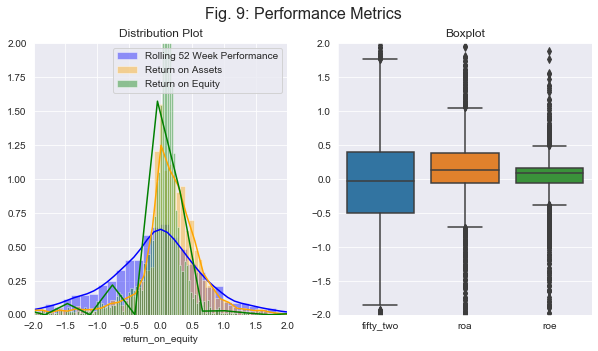

# stock_classifier
By JP Rinfret

## Overview:
Many have tried, and failed, to predict the stock market. Market timing is viewed by many to be nearly impossible and for that reason it tends to be avoided. However, with a discplined approach to adding exposure (e.g., dollar cost averaging into equity exposure), a portfolio manager can reduce timing risk associate with a trade. So with the technical side answered (i.e., when to buy a stock), how do we answer the fundamental side (i.e., what stock to buy)? Well, equity research analysts will tell you that with proper fundamental analysis, you can calculate a company's intrinsic value and compare that to the current common stock market value. This can lead to the analyst publishing a buy, hold, or sell recommendation. While this is obvious a simplified and general overview of how an analyst publishes a recommendation, it begs the question: can we feed a model labeled fundamental data (i.e., can we tell our model what companies are buys or not buys) and have the model learn and make predictions about other companies? That would surely save us a lot of time.

With this project, I attempted just that. I fed many different machine learning algorythms (trees/forests, ensembles, boosting, etc.) labeled fundamental financial data in an attempmt to learn what contributes most to a buy rating. But no model is perfect so by what metric do we compare each model?

As the following will explain, our goal was to reduce capital losses (type I errors) and opportunity cost (type II errors), which led to a focus on F1.

[Executive Overview](https://docs.google.com/presentation/d/1ozVeV62RXFkmIIw2hxEZslO37sevHIF-tYhsow5Eu1Y/edit?usp=sharing)

## Data:
The data was pulled from Yahoo Finance via a RapidAPI. I then used pandas to clean the data, matplotlib/seaborn to visualize the data, and sklearn to make predictions.

## Feature Engineering:
1. Convert all % ratios into integers (e.g., 0.85 = 85)
2. Log transform market cap to its scale relative to other features (in $Bn)(margins, dividend payout, etc.) into multipliers
3. Added limitations to features: (1) only considered stocks with positive dividend payout rations that were less than 100% of earnigns, (2) postive P/B and D/E rations, and (3) gross margins that were greater than -100%.

## Exploratory Data Anlysis:
Target Variables (Original)|Target Variables (Grouped)
:--:|:--:
|

Market Cap (Logged)|Dividend P/O Ratio
:--:|:--:
 | 

Earnings Per Share|Revenue Growth
:--:|:--:
 | 

Price to Earnings|Price to Book
:--:|:--:
 | 

Debt to Equity|Margins
:--:|:--:
 | 

Performance Metrics | Feature Correlations
:--:|:--:
|

## Model Training:
I utilized sklearn's train, test, split with a test size of 0.3 and random_state of 42. I ran a dummy classifier to create a base model, and this model had a F1 Score of 0.6 predicting "Buys". After that I ran a Logistic Regression (used StandardScaler), KNN (looped through a range of K values to find the best F1 Score), and then GridSearched Decision Tree Classifier, Random Forest Classifier, AdaBoost Classifier, Gradient Boosting Classifier, and SVC (used StandardScaler).

See the model_training jupyter notebook to see the range hyperparameters I trained the model on for each classifier.

## Results:
